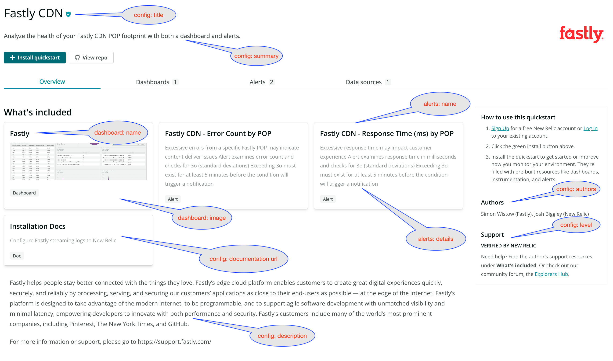
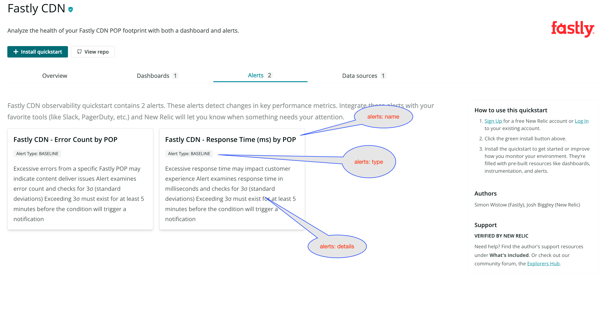
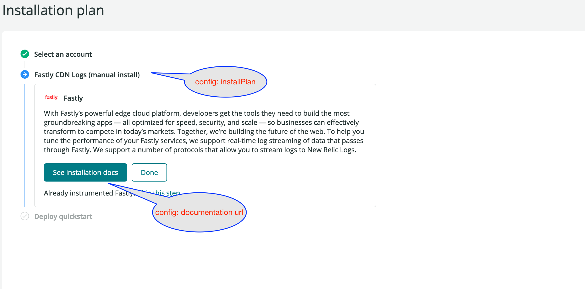

# Contributing

<!-- toc -->
- [Contributing](#contributing)
  - [Welcome 👋](#welcome-)
  - [Quickstart yaml to UI mapping](#quickstart-yaml-to-ui-mapping)
    - [Main config](#main-config)
    - [Alerts](#alerts)
    - [Dashboards](#dashboards)
    - [Data sources](#data-sources)
    - [Install plan](#install-plan)
  - [Quickstart install flow](#quickstart-install-flow)
  - [Quickstarts style guide](#quickstarts-style-guide)
    - [Style tips](#style-tips)
    - [Quickstarts usage](#quickstarts-usage)
    - [Quickstarts description template](#quickstarts-description-template)
  - [Quickstarts contributor guidelines](#quickstarts-contributor-guidelines)
    - [Quickstart PR review workflow](#quickstart-pr-review-workflow)
    - [Quickstart best practices](#quickstart-best-practices)
      - [Authors](#authors)
      - [Install plans](#install-plans)
        - [Creating a new installPlan](#creating-a-new-installplan)
      - [Summary & descriptions](#summary--descriptions)
      - [Documentation](#documentation)
      - [Levels](#levels)
      - [Dashboard JSON](#dashboard-json)
      - [Dashboard screenshots](#dashboard-screenshots)
      - [Images directory](#images-directory)
      - [Logos](#logos)
    - [Keywords](#keywords)
  - [Feature requests](#feature-requests)
  - [Pull requests](#pull-requests)
  - [Using conventional commits](#using-conventional-commits)
    - [Use `chore`](#use-chore)
    - [Use `fix`](#use-fix)
    - [Use `feat`](#use-feat)
  - [Contributor license agreement](#contributor-license-agreement)
  - [Slack](#slack)
  - [Partnerships](#partnerships)
<!-- tocstop -->

## Welcome 👋

Contributions are always welcome. Before contributing please read the
[code of conduct](https://github.com/newrelic/.github/blob/main/CODE_OF_CONDUCT.md)
and [search the issue tracker](../../issues); your issue may have already been discussed or fixed in `main`. To contribute,
[fork](https://help.github.com/articles/fork-a-repo/) this repository, commit your
changes, and [send a Pull Request](https://help.github.com/articles/using-pull-requests/).

Note that our [code of conduct](https://github.com/newrelic/.github/blob/main/CODE_OF_CONDUCT.md)
applies to all platforms and venues related to this project; please follow it in all
your interactions with the project and its participants.

## Quickstart yaml to UI mapping

Quickstarts are defined by several yaml files. These files are used to render the quickstart content on New Relic's external I/O Catalog and within the internal
New Relic I/O Catalog. At this time there isn't any easy way to preview a quickstart as you develop, so we have provided a visual mapping below to explain how each part of the UI is rendered using the quickstart yaml files.

This example is based on the Fastly quickstart which can be [found here](./quickstarts/fastly/config.yml) within the repository and
[here on the external I/O catalog](https://developer.newrelic.com/instant-observability/fastly-cdn/c5c5dd30-dcdf-46b6-9412-f9a1bba5a600)

> please note,  the internal catalog follows a very similar UI pattern.

### Main config



### Alerts



### Dashboards


### Data sources


### Install plan



## Quickstart install flow

The diagram below explains the installation flow each type of quickstart follows.


## Quickstarts style guide

### Style tips

- Maintain a strong active voice. Lead sentences with verbs.
  - Avoid “Allows you to monitor your uptime”
- Avoid being too formal. Avoid words like `thus` and `lastly`, and feel free to use `we` and `our`.
- In general, we should only lightly touch on what a given technology does. The user is already using Node, so we don’t need to sell them on it exactly. What we need to focus on is the challenges of monitoring that technology and then sell on that.

Check out our [doc team's voice and tone guidelines](https://docs.newrelic.com/docs/style-guide/writing-guidelines/voice-strategies-docs-sound-new-relic/).

### Quickstarts usage

When writing about a quickstart the following language rules should be followed:

1. Capitalize the term quickstart if the word is at the start of a sentence or header.

> "Quickstarts are a great way to get started with New Relic!"

2. If the term quickstarts is anywhere else in a sentence, use lower case.

> "New Relic offers you a wide range of quickstarts to get you started."

3. Quickstarts is always a single word.

> "Always use quickstarts, not quick starts."

### Quickstarts description template

```md
  ## Why monitor <QUICKSTART_TECHNOLOGY>

  Explain the role and purpose of monitoring your technology. What are some specific difficulties about the technology? What are useful metrics to monitor?

  ### <QUICKSTART_TECHNOLOGY> quickstart highlights

  Describe the specific features of your quickstart. Mentions things such as dashboard visuals, alerts, and the type of instrumentation. We recommend the following format:

  Quick intro sentence:
  - First highlight
  - Second highlight
  - Third highlight

  ### New Relic + <QUICKSTART_TECHNOLOGY> (Optional)

  Describe how New Relic's capabilities can assist in monitoring your technology outside of what is included in the quickstart. Mention capabilies such as errors inbox, transaction traces, etc.
```

## Quickstarts contributor guidelines

> Review our comprehensive [Developer Guide](https://developer.newrelic.com/contribute-to-quickstarts/) to get starting building your quickstart!

We encourage all contributors to actively engage in the creation and maintenance of quickstarts. Whether you work at New Relic or use New Relic as a customer, the community is open to your expertise!

- `Step 1`: Review the [quickstart Template Config](./_template/config.yml) for a definition of how to create a quickstart.
- `Step 2`: Review the [documentation](https://github.com/newrelic/newrelic-quickstarts/blob/main/docs) for structure and limits you need to consider.
- `Step 3`: Create your quickstart!
- `Step 4`: Submit a PR!
- `Step 5`: Resolve feedback from code reviews.
- `Step 6`: After approval, merge your PR.

When creating a new quickstart or reviewing a PR please keep the following in mind, and refer to the
[quickstart validation workflow](https://github.com/newrelic/newrelic-quickstarts/blob/main/.github/workflows/validate_quickstarts.yml) for current validations.

### Quickstart PR review workflow

When you submit a PR for a new our existing quickstart the follow workflow is executed.

- `Step 1`: A new PR is added the `To do` column of the [NR1 Community Quickstarts project board](https://github.com/newrelic/newrelic-quickstarts/projects/3)
- `Step 2`: A repo maintainer will review the PR and provided feedback. The PR will move to the `In progress` column.
- `Step 3`: Once a review is complete the PR will move to `In review` column and `in-review` label will be applied.
- `Step 4`: When all review feedback is resolved the PR will be merged and moved to the `Done` column and a `released` label will be applied.

### Quickstart best practices

Before getting started, review the [documentation](https://github.com/newrelic/newrelic-quickstarts/blob/main/docs)
for quickstart structure and limits you need to consider.

You should also review the API limits for [dashboards](https://docs.newrelic.com/docs/query-your-data/explore-query-data/dashboards/dashboards-api/#limits) and [alerts](https://docs.newrelic.com/docs/alerts-applied-intelligence/new-relic-alerts/learn-alerts/rules-limits-alerts/) to help you build your quickstart.

#### Authors

Quickstart authors represent the creator of the quickstart.

You can define multiple author names, but it's recommended to use one of the follow formats.

 1. company name
 2. company name + author name
 3. author name

#### Install plans

> See the [docs](https://github.com/newrelic/newrelic-quickstarts/blob/main/docs/main_config.md#installPlans) for more details on `installPlans`.
> You can view all the available `installPlans` in the [Install](https://github.com/newrelic/newrelic-quickstarts/tree/main/install) directory.

- The Ordering of `installPlans` is important as it sets the order of installation in the guided install flow for a user.
- Every quick start that should be "installable"  will require a [destination URL](https://github.com/newrelic/newrelic-quickstarts/blob/main/docs/install_config.md#target_destination) within the [install](https://github.com/newrelic/newrelic-quickstarts/blob/main/docs/install_config.md) configuration if you want use the guided install flow.

##### Creating a new installPlan

> If you need to create a new `installPlan` for a quickstart consider the following best practices.

- When creating a new `installPlan` you can refer to existing plans in the [install directory](./install/) for guidance.
- The install plan `id` is user defined. You'll need to set that value in the configuration file.
- In case of a third party install plan, the install plan `id` should be prefixed with `third-party-`.
- All third party install plans should be store in the[third-party directory](./install/third-party)
- The configuration file name should be `install.yml`.
- keep the install plan `description` succinct as it's informational only.

#### Summary & descriptions

> See the [docs](https://github.com/newrelic/newrelic-quickstarts/blob/main/docs/main_config.md#description) for more details on `description` and `summary`.

- Use the proper YAML formatting `|` for URL `description` and `summary`.
- Please review the [YAML cheat sheet](https://lzone.de/cheat-sheet/YAML) for more details.
- Descriptions shouldn't have `H1` `#` headers, and all `H1` `#` headers will be rendered to `H2` `##` by default.
- Use only 1 `H2` `##` as your top header.
- Use `H3` `###` only throughout the rest of your description. As the markdown only supports up to `H3` `###`.

```yml
description: |
  a description of the quickstart.

summary: |
  a summary of the quickstart.
```

#### Documentation

> See the [docs](https://github.com/newrelic/newrelic-quickstarts/blob/main/docs/main_config.md#documentation) for more details on `documentation`

- The first `documentation URL` listed in the documentation configuration should be the primary doc reference.
- The see installation docs buttons will always link to the primary `documentation URL`.
- Every quick start that should be "installable" needs a `documentation URL` and an `installPlan` configuration if you want use the guided install flow.
- Use the proper YAML formatting `|` for the URL description
- Use the proper YAML formatting `>-` for documentation URL references.
- Please review the [YAML cheat sheet](https://lzone.de/cheat-sheet/YAML) for more details.

```yml
documentation:
  - name: Name of documentation
    description: |
      Description of documentation
    url: >-
      https://docs.newrelic.com/docs/url/
```

#### Levels

> See the [docs](https://github.com/newrelic/newrelic-quickstarts/blob/main/docs/main_config.md#level) for more details on `levels`

- All quickstarts will be set to `Community` level by default unless specified differently by the `Author`.
- Levels can only be modified by New Relic employees.
- If you have questions on how to increase the level of support please file an [issue](../../issues)
- The shield icon is only applied to those quickstarts with `Support Level` New Relic OR `Support Level` Verified.


#### Dashboard JSON

> See the [docs](https://github.com/newrelic/newrelic-quickstarts/blob/main/docs/dashboard_config.md) for more details on `dashboards`

- When copying dashboard JSON from the New Relic One platform a `permissions` field is included in the code. You do not need this in a quickstart's dashboard JSON.
- If you wish to import a quickstart's dashboard into New Relic outside of the quickstart install flow, you will need to include this `permissions` field.
- Refer to this [documentation](https://docs.newrelic.com/docs/query-your-data/explore-query-data/dashboards/dashboards-charts-import-export-data/) on importing / exporting dashboards from the New Relic One platform.

```json
{
  "name": "Dashboard Name",
  "description": null,
  "permissions": "PUBLIC_READ_WRITE",
}
```

#### Dashboard screenshots

> See the [docs](https://github.com/newrelic/newrelic-quickstarts/blob/main/docs/dashboard_config.md#pages_items_anyOf_i0_additionalProperties) for more details on `dashboards`

- Dashboard images are `optional` but highly recommended to preview the visual functionality of a dashboard.
- File name should be `quickstart_name01`, `quickstart_name02`, etc
- Dashboards images should be stored in the quickstart's dashboard directory. ex: `/quickstart_name01/dashboards`.
- Must be in `.png`, `.jpg`, `.jpeg` or `.svg` format
- Each image file must be less than `4MB` in size
- There should be no more than `6`  dashboard images per dashboard
- For best results use aspect ratio: 3:2
- For best results use 800 px (width)
- For best results use 1600 px (height)

#### Images directory

> See the [docs](https://github.com/newrelic/newrelic-quickstarts/blob/main/README.md#getting-started) for more details on `dashboards`

- These images are `optional` and should contain images you want to display within a markdown widget on your Dashboard.
- File name should be `quickstart_name01`, `quickstart_name02`, etc
- These images should be stored in the quickstart's images directory. ex: `/quickstart_name01/images`.
- Must be in `.png`, `.jpg`, `.jpeg` or `.svg` format
- Each image file must be less than `4MB` in size
- There should be no more than `6`  dashboard images per dashboard
- See our Python quickstart for examples:
  - What this looks like in the [dashboard.json](https://github.com/newrelic/newrelic-quickstarts/blob/da20c880429988452dc18afd3554998e0658d0e4/quickstarts/python/python/dashboards/python.json#L37)
  - What the dashboard [looks like in New Relic](https://github.com/newrelic/newrelic-quickstarts/blob/main/quickstarts/python/python/dashboards/python.png)

#### Logos

> See the [docs](https://github.com/newrelic/newrelic-quickstarts/blob/main/docs/main_config.md#logo) for more details on `logos`
> If you don't have a logo for your quickstart, you can use a [generic new relic logo](./images/newrelic-generic-logo.svg).

- Logo files should go in the root quickstart directory, `/quickstarts_name01`
- Logos are `required` and are used in both the Public Catalog and in New Relic One.
- `.png` or `.jpeg` or `.svg` format
- Max 1
- Aspect ratio: 1:1
- 250px (width) x 100px (height)

### Keywords

> See the [docs](https://github.com/newrelic/newrelic-quickstarts/blob/main/docs/main_config.md#keywords) for more details on `keywords`

When adding keywords to a quickstart the following format should be used.  Keywords are used in UI navigation, filters and labels within
the New Relic One I/O Catalog and the External I/O Catalog.

``` yml
keywords:
  - a keyword
  - another keyword
  - yet another keyword
```

Keywords are strictly defined and you should provide a standard set of keywords in your quickstart from the list below. If you submit a keyword
that is not defined in this list below, it will be reviewed for use after you submit a PR.

> the `featured` keyword is used to feature quickstarts. It can only be set by a New Relic employee.

- apm
- automation
- cms
- containers
- content management system
- database
- golang
- infrastructure
- java
- kubernetes
- language agent
- load balancer
- messaging
- mobile
- .net
- networking
- node.js
- os
- operating system
- open source monitoring
- php
- python
- queue
- ruby
- synthetics
- testing
- tracing
- windows

## Feature requests

Feature requests should be submitted in the [Issue tracker](../../issues), with a description of the expected behavior & use case, where they’ll remain closed until sufficient interest, [e.g. :+1: reactions](https://help.github.com/articles/about-discussions-in-issues-and-pull-requests/), has been [shown by the community](../../issues?q=label%3A%22votes+needed%22+sort%3Areactions-%2B1-desc).
Before submitting an Issue, please search for similar ones in the
[closed issues](../../issues?q=is%3Aissue+is%3Aclosed+label%3Aenhancement).

## Pull requests

1. Ensure that all new commits follow the [Conventional Commit](#using-conventional-commits) syntax.
2. Provide a short description of the changes and screenshots of any visual changes.
3. Ensure that all status checks are passing.
4. You may merge the Pull Request in once you have the sign-off of one other developer, or if you do not have permission to do that, you may request the reviewer to merge it for you.
5. Once your PR is merged, changes should be reflected both in the Public Catalog and in New Relic One I/O within `4 hours`

## Using conventional commits

Please help the maintainers by leveraging the following [conventional commit](https://www.conventionalcommits.org/en/v1.0.0/)
standards in your pull request title and commit messages.

### Use `chore`

- for minor changes / additions / corrections to content.
- for minor changes / additions / corrections to images.
- for minor non-functional changes / additions to github actions, github templates, package or config updates, etc

```bash
git commit -m "chore: adjusting config and content"
```

### Use `fix`

- for minor functional corrections to code.

```bash
git commit -m "fix: typo and prop error in the code of conduct"
```

### Use `feat`

- for major functional changes or additions to code.

```bash
git commit -m "feat(media): creating a video landing page"
```

## Contributor license agreement

Keep in mind that when you submit your Pull Request, you'll need to sign the CLA via the click-through using CLA-Assistant. If you'd like to execute our corporate CLA, or if you have any questions, please drop us an email at opensource@newrelic.com.

For more information about CLAs, please check out Alex Russell’s excellent post,
[“Why Do I Need to Sign This?”](https://infrequently.org/2008/06/why-do-i-need-to-sign-this/).

## Slack

We host an internal help [Slack channel](https://newrelic.slack.com/archives/C02CM0D5QBF). You can contact the teams supporting quickstarts and I/O with any questions here.

## Partnerships

> to be updated
